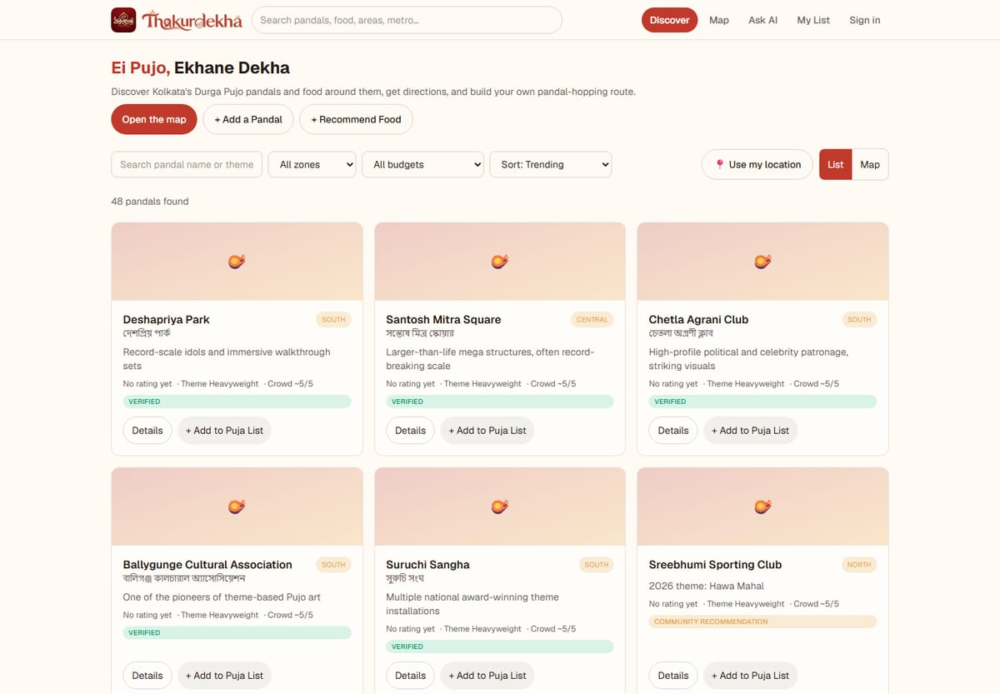
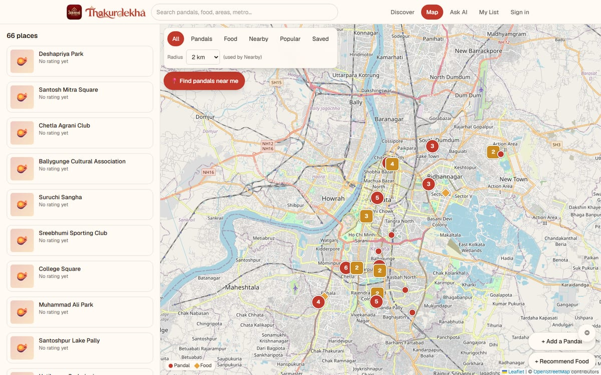
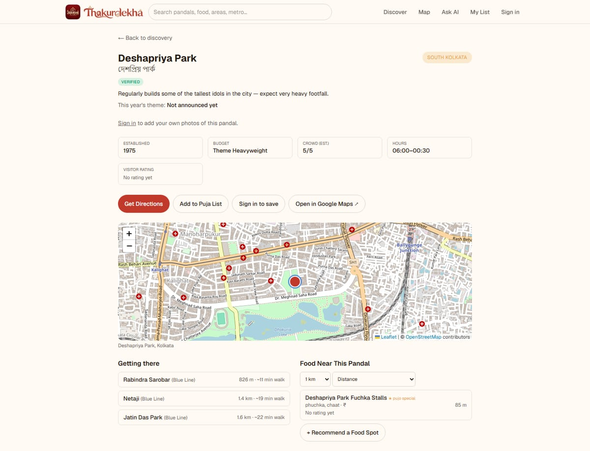

<div align="center">


# Thakurdekha · ঠাকুরদেখা

**Ei Pujo, Ekhane Dekha.** Discover Kolkata's Durga Puja pandals and the food around them, get directions, and plan a pandal-hopping route.

[**Live app**](https://thakurdekha.vercel.app)

</div>



## What it does

Pandal hopping in Kolkata means dozens of crowded, scattered venues and one night to see them. Thakurdekha helps you decide where to go, how to get there, and where to eat on the way.

- **Discover** 48 pandals with zone, budget, crowd estimate, theme, nearest metro and opening hours. Search by name, area, theme or metro, and filter by zone and budget.
- **Explore on a map** with clustered pins for pandals and food places, a "find near me" mode, and radius filters.
- **Get directions** by walking or driving (plus transit when a Google key is configured), or open the place straight in Google Maps.
- **Plan a route.** Add pandals and food stops to your Puja List, drag to reorder, let the optimizer shorten the path, and export it to Google Maps.
- **Ask the assistant.** A Gemini-powered chat builds a route from natural-language requests such as *"a 4-hour South Kolkata route with a good food stop"*, using only places in the database.
- **Contribute.** Signed-in users can add pandals and food places, write reviews, report problems, and submit photos. Everything is moderated before it appears.
- **Save and track** pandals you want to see and the ones you have visited.

<table>
  <tr>
    <td width="50%"></td>
    <td width="50%"></td>
  </tr>
  <tr>
    <td align="center"><sub>Clustered map with pandals and food</sub></td>
    <td align="center"><sub>Pandal page: metro access, nearby food, directions</sub></td>
  </tr>
</table>

## Honest data, on purpose

Community content and unverified listings are never presented as fact.

| Badge | Meaning |
|---|---|
| **Verified** | Approved by an admin and marked verified |
| **Community recommendation** | Approved, but not officially verified |
| **Pending** | Waiting for moderator review, not shown publicly |

- **Ratings come only from real reviews.** With none, the app says "No rating yet". Nothing is invented.
- **2026 directory entries are unverified.** Where a theme or history is not confirmed, the app says so instead of filling it in.
- The AI assistant may only use data returned by its database tools, and every stop it proposes is checked against real records.
- User location is used in the browser for the current request only. It is not stored or logged.

## Admin portal

Admins (set through `ADMIN_EMAILS` or granted in the portal) get `/admin`:

- **Overview**: live content counts, a review backlog, and 7-day activity.
- **Moderation**: pending pandals, food places, recommendations and **photos**, reported content and reviews, and duplicate candidates with merge.
- **Pandals / Food places**: search every record and edit all fields (theme, history, zone, coordinates, photos), verify, hide, flag or delete.
- **Users**: view accounts and grant or revoke admin, with self-lockout and env-admin safeguards.

## Tech stack

| Area | Choice |
|---|---|
| Framework | Next.js 16 (App Router, Turbopack), React 19, TypeScript |
| Styling | Tailwind CSS 4 |
| Database | libSQL: Turso in production, a local SQLite file in development |
| Images | Vercel Blob in production, local disk in development; decoded, re-encoded to WebP, metadata stripped |
| Maps | Leaflet with marker clustering and OpenStreetMap tiles |
| Routing | Google Routes API when a key is set, otherwise a labelled straight-line estimate |
| AI | Google Gemini via server-side tool calling, with automatic model fallback |
| Auth | Email and password (scrypt), hashed session tokens, HttpOnly cookies |
| Validation | Zod on every endpoint |
| Tests | Vitest and Testing Library (94 tests) |

## Getting started

Requires **Node.js 20.9 or newer** (a Next.js 16 requirement). Developed and tested on a recent Node release.

```bash
git clone https://github.com/itsoummy/thakurdekha.git
cd thakurdekha
npm install
cp .env.example .env.local
npm run dev
```

Open <http://localhost:3000>. With no configuration it creates `data/thakurdekha.db` and seeds the pandals and food places automatically. The first account you register with an email listed in `ADMIN_EMAILS` becomes an admin.

### Environment variables

| Variable | Purpose | Required |
|---|---|---|
| `ADMIN_EMAILS` | Comma-separated emails that get the admin role | Recommended |
| `TURSO_DATABASE_URL` / `TURSO_AUTH_TOKEN` | Production database. `DB_TURSO_*` from the Vercel integration also works | Production |
| `BLOB_READ_WRITE_TOKEN` | Image storage on Vercel. Without it, images go to `./uploads` | Production |
| `GEMINI_API_KEY` | Enables the assistant. Optional `GEMINI_MODEL` overrides the default | Optional |
| `GOOGLE_MAPS_API_KEY` | Real routes, geocoding and transit (enable Routes, Geocoding and Places APIs) | Optional |
| `DATABASE_PATH`, `UPLOAD_DIR`, `SEED_DATABASE` | Local overrides | Optional |

All keys are server-side only and are never sent to the browser. `GET /api/config` exposes booleans only.

## Deploying to Vercel

1. Push the repo to GitHub and import it in Vercel.
2. Add a **Turso** database (Vercel Storage integration, or create one at turso.tech) and set the database URL and token.
3. Create a **public Vercel Blob** store, connect it with a read-write token, and let it set `BLOB_READ_WRITE_TOKEN`.
4. Set `ADMIN_EMAILS` and, if you want them, `GEMINI_API_KEY` and `GOOGLE_MAPS_API_KEY`.
5. Deploy. Tables and seed data are created on the first request.

The app refuses to start on Vercel without a real database instead of silently using temporary storage.

## Testing

```bash
npm test          # 94 tests: API, unit and UI
npm run lint
npm run build
```

API tests call the route handlers directly against a throwaway libSQL database. They cover auth, moderation, duplicates, photos, uploads, routing fallbacks, and the AI tool loop with a mocked Gemini.

## Project layout

```
src/
  app/            Pages and API route handlers (App Router)
    api/          auth, pandals, food, photos, reviews, reports, plans, routes,
                  uploads, assistant, admin/*
    admin/        Admin portal
  components/     UI, map, admin tabs, uploaders
  server/         db (libSQL), migrations, auth, repo, moderation, storage,
                  gemini, map service, validation
  lib/            spatial maths, route optimizer, client helpers
  data/           Seed pandals, food places, 2026 directory entries
tests/            api, unit and ui suites
docs/screenshots/ README images
```

## Security notes

- Passwords hashed with scrypt. Session tokens are stored only as SHA-256 hashes, in HttpOnly SameSite cookies.
- State-changing requests are checked against the request origin.
- Uploads are validated by decoding, size-capped, converted to WebP and stripped of metadata.
- Rate limits protect sign-in, uploads, submissions and the assistant.
- Community text is treated as untrusted, including inside the AI assistant's prompts.

## Known limitations

- Rate limiting is in memory, so it is per server instance on serverless hosting. A shared store such as Redis would make it global.
- Without a Google Maps key, route distances are labelled estimates and transit is unavailable.
- Spatial queries use bounding boxes and haversine distance. PostGIS would be the next step at larger scale.
- There is no password-reset email flow yet.
- Pandal themes for the current year change often. Verify against official committee announcements before travelling.

## Contributing

Issues and pull requests are welcome. Please run `npm run lint` and `npm test` first, and don't submit copyrighted photos.

## License

[MIT](LICENSE) © 2026 itsoummy
